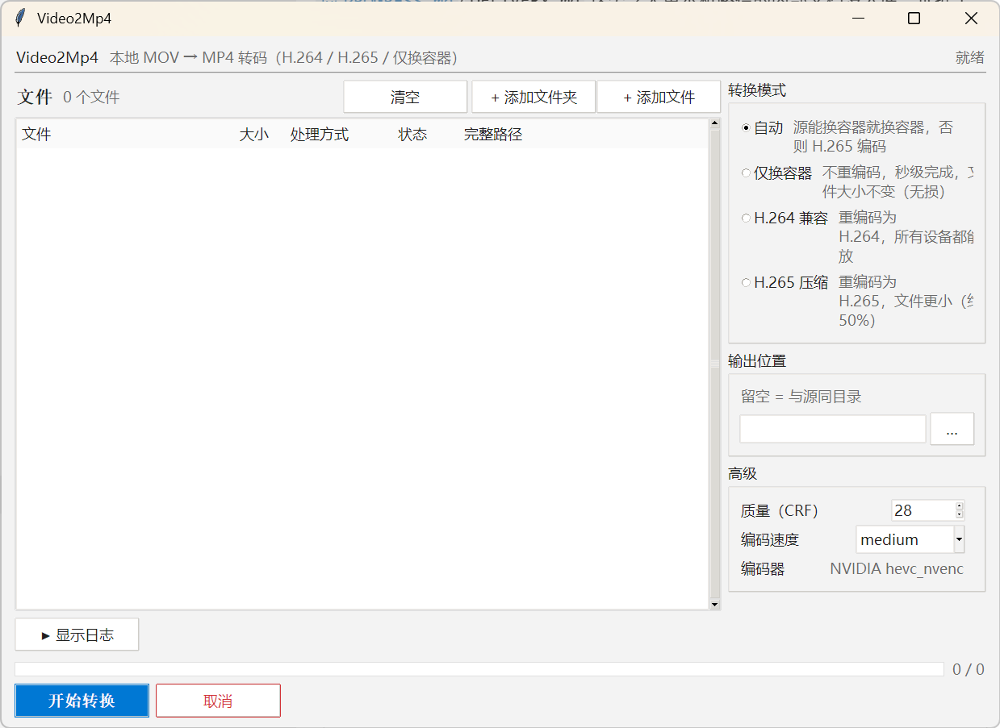

<div align="center">

**中文** · [English](./README.en.md)

# 🎬 Video2Mp4

#### 把一堆格式乱七八糟的视频，拖进去，出来就是 MP4

[](./LICENSE)
[](#-安装)
[](#-技术栈)
[](#-安装)


</div>

> **源码已公开，v0.1.0 可直接下载**。要现成的就 [**拿走 Video2Mp4.exe**](https://github.com/zcy205321334-bit/Video2Mp4/releases/latest)，想自己打的往下看[构建](#-构建)。
> 运行前要装 FFmpeg，见[安装](#-安装)，不装的话开始按钮是灰的。

---

## 📋 目录

| 名字 | 一句话 |
|---|---|
| 🎬 [**它能做什么**](#-它能做什么) | 四种转换模式加十二项能力，一眼看完 |
| 📦 [**安装**](#-安装) | **先装 FFmpeg**，再拿 exe，顺序别反 |
| 🚀 [**使用**](#-使用) | 拖进去，选模式，点开始 |
| 🛠️ [**技术栈**](#-技术栈) | Python 3.11 加 Tkinter 加 FFmpeg |
| 🔨 [**构建**](#-构建) | 源码就在本仓库，怎么自己打一个 |
| 📝 [**路线图**](#-路线图) | 做了什么，接下来做什么 |
| ❓ [**常见问题**](#-常见问题) | 启动提示缺依赖怎么办 |

---

## 🎬 它能做什么

我电脑里的视频什么格式都有。手机拍的 mov，网上下的 mkv、flv，录屏软件吐出来的 ts、wmv，还有一堆记不清哪来的 avi。Windows 自带的播放器认得动的不多，装个全能编解码器包吧，又总担心哪天把系统搞出一堆莫名其妙的东西。

后来我想通一件事，这些文件里九成我最后要的都是 mp4。设备认它，剪辑软件认它，发给别人也不用解释该用什么打开。于是有了这个工具，把文件拖进来，选个模式，出来就是 mp4。它不联网，不上传，转码的活全交给你机器上自己的 FFmpeg。

<p align="center">
  
</p>

### 四种转换模式

转换模式就四个。选错是新手最常踩的坑，所以每个都写清了适用场景。

| 模式 | 干什么 | 什么时候用 |
|---|---|---|
| ⚡ **自动** | 源能换容器就换容器，否则 H.265 编码 | 懒得挑，交给它自己判断 |
| 📦 **仅换容器** | 不重编码，秒级完成，文件大小不变（**无损**） | 只是想把 mkv、ts 换个壳成 mp4 |
| 🎬 **H.264 兼容** | 重编码为 H.264，所有设备都能播放 | 要丢给老电视、老手机、PPT 用 |
| 🗜️ **H.265 压缩** | 重编码为 H.265，文件更小（**约 50%**） | 存档，省硬盘，接受部分老设备不认 |

> 💡 只想换格式，选**仅换容器**。它不碰画质，两小时的片子几秒钟完事。选成重编码模式，同样的片子可能要跑半小时。

### 其它

| 能力 | 说明 |
|---|---|
| 🖱️ **拖拽添加** | 视频直接拖进窗口（tkinterdnd2），也留着添加文件按钮 |
| 📁 **文件夹递归** | 拖一个文件夹进来，子目录它自己翻 |
| 🎞️ **10 种输入格式** | `.mov` `.mp4` `.mkv` `.avi` `.m4v` `.flv` `.wmv` `.ts` `.webm` `.3gp` |
| 🧠 **硬件编码自动探测** | 探测 NVIDIA(NVENC)、AMD(AMF)、Intel(QSV)，有就用，没有退回 CPU |
| 🎚️ **高级参数可调** | 质量（CRF）、编码速度（preset 九档）、编码器，折在高级面板里 |
| 📂 **输出位置可选** | 留空就写回源目录，也可以另指一个地方 |
| 🛑 **随时取消** | 单个 CancelToken 贯穿全程，点了就停，不留半个文件 |
| 📋 **五列文件列表** | 文件、大小、处理方式、状态、完整路径 |
| 📜 **可折叠日志** | 失败摘要加逐条详情，出问题时有据可查 |
| 🌗 **跟随系统主题** | 实时跟着 Windows 的浅色深色切，不用重启 |
| 🖥️ **高 DPI 感知** | PerMonitorV2，2K、4K 屏上不糊 |
| 🟢 **绿色单文件** | 就一个 exe，不写注册表，也不装服务 |

---

## 📦 安装

### 第 1 步，先装 FFmpeg（**必须**）

这里有个新手最容易栽的跟头。Video2Mp4 **自己不带 FFmpeg**，转码和媒体探测全靠它。没装的话程序一打开就提示缺依赖，开始按钮是灰的，怎么点都没反应。

从 [gyan.dev](https://www.gyan.dev/ffmpeg/builds/) 下载 `ffmpeg-release-essentials.zip`，解压（比如解到 `C:\ffmpeg`），然后把 `bin` 目录加进 PATH。

```powershell
[Environment]::SetEnvironmentVariable(
  "Path",
  [Environment]::GetEnvironmentVariable("Path", "User") + ";C:\ffmpeg\bin",
  "User"
)
```

**新开一个终端**验证，两条都要有输出。

```powershell
ffmpeg -version
ffprobe -version
```

> ⚠️ PATH 只对**新开的**终端生效，这是最常见的一次性卡点。程序也要重启一次才能读到新 PATH。

### 第 2 步，拿 Video2Mp4.exe

去 [**Releases**](https://github.com/zcy205321334-bit/Video2Mp4/releases/latest) 下载最新版，双击就跑。单文件，不写注册表，不装服务。当前版本 **v0.1.0**，约 10.87 MB（Windows 10/11 x64）。

> 💡 介意文件来路的话，对一下哈希。
> `701a86b5beb5b5afb121c0adf0d61f74fd1bd4d2737ff2146260874d1dbe5c54`

```powershell
Get-FileHash .\Video2Mp4.exe -Algorithm SHA256
```

### （可选）建个开始菜单快捷方式

```powershell
$ws = New-Object -ComObject WScript.Shell
$sc = $ws.CreateShortcut("$env:APPDATA\Microsoft\Windows\Start Menu\Programs\Video2Mp4.lnk")
$sc.TargetPath = "C:\path\to\Video2Mp4.exe"
$sc.WorkingDirectory = "C:\path\to"
$sc.Save()
```

---

## 🚀 使用

1. 启动 `Video2Mp4.exe`
2. 把视频拖进窗口，整个文件夹也行，子目录它自己翻
3. 选一个转换模式。只想换格式就选**仅换容器**
4. 需要的话展开高级面板，调质量（CRF）、速度、编码器
5. 点开始转换，等进度条走完
6. 输出出现在源目录，或者你指定的地方

窗口底部有汇总，完成几个、失败几个。有失败的点开日志看详情。

几句提醒。H.264 兼容性最广，H.265 更省空间，但老设备可能放不出来。硬件编码要显卡和驱动配合，探测不到也没关系，它会自动退回 CPU，功能不受影响。第一次用建议先拿一小段试试，画质和体积都满意了再批量。输出重名它会自己加序号，不会覆盖你已有的文件。

---

## 🛠️ 技术栈

| 组件 | 用途 |
|---|---|
| Python 3.11 | 主语言 |
| Tkinter + ttk | GUI（`clam` 主题） |
| tkinterdnd2 | 拖拽支持（内置 win-x64、win-arm64 原生库） |
| FFmpeg / ffprobe | 转码核心加媒体流探测（**外部依赖，需自备**） |
| NVENC / AMF / QSV | NVIDIA、AMD、Intel 硬件编码 |
| libx264 / libx265 | CPU 软件编码 |
| PyInstaller | 打包为单文件 exe |

---

## 🔨 构建

源码就在这个仓库里，想自己打一个的话。

```bash
git clone https://github.com/zcy205321334-bit/Video2Mp4.git
cd Video2Mp4
pip install -r requirements.txt
pip install pyinstaller
pyinstaller Video2Mp4.spec
```

产物在 `dist\Video2Mp4.exe`。

仓库里还带了六个测试，改完代码想验收，跑这两个最省事。

```bash
PYTHONPATH=. python tests/acceptance_theme.py
PYTHONPATH=. python tests/acceptance_smoke.py
```

前者验主题配色和对比度，后者会做真实的转码，需要机器上有 FFmpeg。

---

## 📝 路线图

- [x] 10 种输入格式转 MP4
- [x] 四种转换模式（自动、仅换容器、H.264、H.265）
- [x] 硬件编码自动探测（NVENC、AMF、QSV）加 CPU 回落
- [x] 仅换容器无损秒转
- [x] 拖拽加文件夹递归
- [x] 跟随系统主题实时切换
- [x] 高 DPI 感知
- [x] **公开源码**
- [x] **首个 Release（含 exe）**
- [ ] 批量队列
- [ ] 暂停、继续（当前只有取消）

---

## ❓ 常见问题

**Q. 启动就提示缺依赖，开始按钮是灰的？**

FFmpeg 没装好，或者装了但没进 PATH。按[安装第 1 步](#第-1-步先装-ffmpeg必须)做一遍，**新开终端**跑 `ffmpeg -version`，有输出才算数。程序要重启一次才能读到新 PATH。

**Q. 转出来怎么比原文件还大？**

你选的是重编码模式（H.264 或 H.265）。只想要 mp4 这个壳的话，换**仅换容器**，它不重编码，大小不变。

**Q. 为什么用不了硬件加速？**

程序会自己探测。探测不到通常是显卡驱动太旧，或者你的卡不支持对应的编码器。探测失败不影响使用，自动走 CPU。

**Q. 会偷偷上传我的视频吗？**

不会。纯本地 GUI，没有联网代码，转码全由你本机的 FFmpeg 完成。

---

## 📄 许可证

[MIT](./LICENSE) · © 2026 zcy205321334-bit

---

<div align="center">

顺手做的小工具，给和我一样懒得给 Windows 装编解码器的人用。

Made by [@zcy205321334-bit](https://github.com/zcy205321334-bit)

</div>
